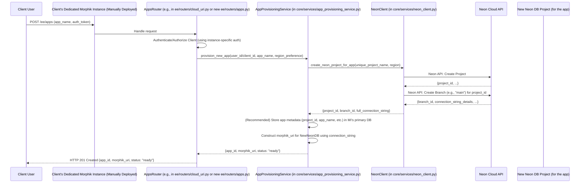

# Scoped Design: Dynamic App Provisioning with NeonDB for Client Instances

## 1. Goal

Enable a client, operating within their manually pre-deployed Morphik instance, to programmatically create new "apps." Each "app" will correspond to a new, isolated Neon database project, and the client will receive a `morphik://` URI (or similar) to access it. This design focuses on the programmatic creation of these app-specific databases, deferring the full instance upgrade path and initial data migration.

## 2. Assumptions

*   **Manual Main Instance Deployment:** A dedicated Morphik server instance is manually deployed for the client (e.g., on GCP Cloud Run or similar). This instance is configured with its own primary database (which could also be a Neon project, but its setup is outside this scope).
*   **Client Authentication:** The client authenticates to *this dedicated Morphik instance* to use its APIs.
*   **Neon Account & API Keys:** The organization possesses a Neon account, and Neon API keys are securely configured as environment variables within the client's dedicated Morphik instance.

## 3. Core Workflow

The client, through their dedicated Morphik instance, requests the creation of a new "app." The Morphik instance then orchestrates the creation of a new Neon database project and returns access details for this new app.



## 4. Key Components & Implementation Details

### 4.1. Client's Dedicated Morphik Instance

*   Manually deployed and configured.
*   Environment variables must include `NEON_API_KEY`.
*   Its primary database can be used to store metadata about the "apps" it provisions (see "Catalog Database" concept from Neon documentation: [Designing a Control Plane](https://neon.tech/docs/use-cases/database-per-user)).

### 4.2. API Endpoint for App Creation

*   **Path:** `POST /ee/apps` (consider if this should be a new route or an adaptation of existing logic in `ee/routers/cloud_uri.py`). Given the existing `ee/routers/cloud_uri.py` (found at `/Users/arnav/Desktop/databridge/databridge-core/ee/routers/cloud_uri.py`), it should be evaluated if the `create_app` function with `isolated=true` (as mentioned in the original `design.md`) can be adapted or if a new, cleaner endpoint in a new file like `ee/routers/apps.py` is preferable for this specific client-instance use case.
*   **Request Body Example:**
    ```json
    {
      "app_name": "my-new-campaign-data",
      "region": "aws-us-west-2" // Optional: Neon region for the new project
    }
    ```
*   **Response Body Example (Success - 201 Created):**
    ```json
    {
      "app_id": "<generated_unique_app_id>",
      "app_name": "my-new-campaign-data",
      "morphik_uri": "morphik://<user>:<password>@<neon_host>:<port>/<database_name>", // Exact URI structure TBD
      "status": "ready"
    }
    ```
*   **Authentication:** Standard Morphik instance authentication (e.g., JWT issued by this dedicated instance).

### 4.3. `AppProvisioningService`

*   **Location:** New file, e.g., `core/services/app_provisioning_service.py`.
*   **Responsibilities:**
    *   Orchestrate the creation of a new "app."
    *   Generate unique names for Neon projects (e.g., `clientid-appname-uuid`).
    *   Invoke `NeonClient` to provision the Neon project and its primary branch.
    *   (Recommended) Persist metadata about the provisioned app (Neon project ID, app name, client identifier, creation timestamp, status) in the Morphik instance's primary database. This mirrors the "catalog database" concept described in Neon's [Designing a Control Plane](https://neon.tech/docs/use-cases/database-per-user) documentation, helping manage multiple app-specific databases.
    *   Construct the `morphik://` URI using the connection details from `NeonClient`.
    *   Handle errors from `NeonClient` and update app status accordingly.

### 4.4. `NeonClient`

*   **Location:** New file, e.g., `core/services/neon_client.py`.
*   **Purpose:** An asynchronous Python client (e.g., using `httpx`) to interact with the Neon V2 API.
*   **Configuration:** Initialized with the `NEON_API_KEY` from environment variables.
*   **Key Methods:**
    *   `async def create_project(project_name: str, region: str = "aws-us-east-1", **kwargs) -> dict:` Creates a new Neon project. Refer to Neon API for details. This aligns with Neon's "project-per-user" model ([Neon Docs: Partner Get Started](https://neon.tech/docs/guides/partner-get-started), [Neon Docs: Database-per-user](https://neon.tech/docs/use-cases/database-per-user)). Neon projects are typically ready in milliseconds ([Neon Docs: SaaS Apps](https://neon.tech/docs/use-cases/saas-apps)).
    *   `async def create_branch(project_id: str, branch_name: str = "main", **kwargs) -> dict:` Creates a primary branch (e.g., "main") for the project. This will return connection details.
    *   `async def get_connection_string(project_id: str, branch_id: str, role_name: str, db_name: str) -> str:` Helper to construct or retrieve the full connection string. (Neon API often returns components, or a direct connection URI for the primary role/db).
    *   `async def delete_project(project_id: str):` For future teardown functionality.
*   **Error Handling:** Should raise specific exceptions for API errors (e.g., `NeonAPIError`) that `AppProvisioningService` can catch.

### 4.5. `morphik://` URI Structure

*   The exact structure of the `morphik://` URI needs to be defined. It must contain all necessary information for the Morphik system to connect to the *newly provisioned Neon database*.
*   This typically includes username, password, host, port, and database name.
*   Example: `morphik://<role_name>:<password>@<neon_endpoint_host>:<port>/<database_name>`
*   Consider how these credentials will be managed and if they are specific to each "app." Neon's API provides role and database details upon project/branch creation.

### 4.6. (Optional) Initial Schema Deployment

*   If each new "app" database requires a specific initial schema, the `AppProvisioningService` could be extended to run schema migration scripts against the newly created Neon database immediately after provisioning. This could use standard database migration tools.

## 5. NeonDB Specific Considerations (from @NeonDB docs)

*   **Project-per-User (App) Model:** This design directly implements Neon's strongly recommended "project-per-user" (in our case, per-app) architecture. This offers:
    *   **Complete Data Isolation:** Highest level of security and privacy ([Neon Docs: Database-per-user = Project-per-user](https://neon.tech/docs/use-cases/database-per-user)).
    *   **Independent Scalability & Performance:** Each app's database scales independently.
    *   **Per-Customer PITR:** Point-in-Time Restore can be done per-app ([Neon Docs: Database-per-user = Project-per-user](https://neon.tech/docs/use-cases/database-per-user)).
*   **API-Driven Management:** Neon is designed to be API-first, making automation of project creation, branching, and configuration straightforward ([Neon Docs: Managing many projects](https://neon.tech/docs/use-cases/database-per-user)).
*   **Cost-Efficiency (Scale-to-Zero):** Neon's scale-to-zero feature means compute costs are only incurred for active databases, making it economical to have many app-specific databases that might have intermittent usage ([Neon Docs: Managing many projects](https://neon.tech/docs/use-cases/database-per-user)).
*   **Connection Limits:** Be mindful of Neon's connection limits per compute size. Connection pooling (provided by Neon or implemented in Morphik) might be necessary if many concurrent connections to an app's database are expected ([Neon Docs: Partner Get Started](https://neon.tech/docs/guides/partner-get-started)).
*   **Regions:** Allow specifying regions for Neon projects for data residency or latency optimization ([Neon Docs: Database-per-user = Project-per-user](https://neon.tech/docs/use-cases/database-per-user)).
*   **Catalog Database for App Metadata:** The client's main Morphik instance database, when storing metadata about these Neon-backed apps, acts as a form of "catalog database" as described in [Neon Docs: Designing a Control Plane](https://neon.tech/docs/use-cases/database-per-user). This is crucial for managing the created Neon projects.

## 6. Security Considerations

*   **Neon API Key Management:** The `NEON_API_KEY` must be stored securely (e.g., as an environment variable or using a secrets manager) in the client's dedicated Morphik instance. It should have appropriate, least-privilege permissions on the Neon account if possible.
*   **App Database Credentials:** The credentials embedded in or associated with the `morphik://` URI for each new app database must be unique per app and securely generated. Neon creates a default role upon project creation; use these credentials.
*   **Access Control:** Ensure that only authenticated and authorized users of the client's Morphik instance can trigger the creation of new apps.

## 7. Future Considerations (Out of Scope for this Iteration)

*   **App Teardown:** Implementing a `DELETE /ee/apps/{app_id}` endpoint that decommissions the Neon project.
*   **Automated Schema Migrations:** Robust system for managing schema versions across all app databases.
*   **Usage Monitoring & Limits:** Tracking usage per app database and potentially enforcing limits.
*   **Dashboard/UI:** A user interface within the client's Morphik instance to view and manage their created "apps."
*   **Error Handling and Retries:** More sophisticated error handling and retry mechanisms for Neon API interactions.

## 8. Diagram (Repeated for Clarity)


## 9. Implementation Steps & Specifications

### 9.1 Environment & Infrastructure Setup
1. Clone this repository and install dependencies:
   - Command: `git clone https://github.com/your-org/databridge-core.git && cd databridge-core && pip install -r requirements.txt`
   - Specification: Should exit with status code 0 and no error messages.
2. Provision the Morphik service on GCP (Cloud Run example):
   - Command:
     ```bash
     gcloud run deploy morphik-instance \
       --source . \
       --region us-central1 \
       --platform managed \
       --set-env-vars=NEON_API_KEY=$NEON_API_KEY,DATABASE_URL=$DATABASE_URL \
       --allow-unauthenticated
     ```
   - Specification: Deployment succeeds, and `gcloud run services describe morphik-instance` shows the service URL and environment variables set.

### 9.2 Data Model & Migrations
1. Create the `app_metadata` table via Alembic:
   - File: `core/migrations/versions/<timestamp>_create_app_metadata_table.py`
   - Specification: `alembic upgrade head` populates `app_metadata` in the database; verifying `SELECT table_name FROM information_schema.tables WHERE table_name='app_metadata'` returns one row.
2. Define the Pydantic and ORM model:
   - File: `core/models/app_metadata.py`
   - Specification: Importing the `app_metadata` module yields the `AppMetadata` class with fields matching the DB columns.

### 9.3 API Endpoint
1. Add a new router at `ee/routers/apps.py`:
   - Path: `POST /ee/apps`
   - Request Model: `{ "app_name": string, "region": string (optional) }`
   - Response Model: `{ "app_id": string, "app_name": string, "morphik_uri": string, "status": "ready" }`
   - Specification: Requests with valid JWT return HTTP 201 and a JSON payload conforming to the response model. Unauthorized requests return HTTP 401.

### 9.4 AppProvisioningService
1. Implement in `core/services/app_provisioning_service.py`:
   - Method: `async def provision_new_app(user_id: str, app_name: str, region: str) -> ProvisionResult`
   - Specification: Invoking this method returns a `ProvisionResult` containing `app_id`, `morphik_uri`, and `status='ready'` when Neon API calls succeed; raises an exception otherwise.

### 9.5 NeonClient
1. Implement in `core/services/neon_client.py`:
   - Methods:
     - `create_project(project_name: str, region: str) -> dict`
     - `create_branch(project_id: str, branch_name: str) -> dict`
     - `build_connection_string(...) -> str`
   - Specification: Each method returns the expected JSON structure from Neon's API; network errors yield `NeonAPIError`.

### 9.6 Schema Initialization (Optional)
1. Include initial migration scripts under `core/schema/`:
   - Specification: After provisioning, running `alembic -x db_url=<new_db_url> upgrade head` applies the initial schema without errors.

### 9.7 Testing & CI
1. Write unit tests for both `AppProvisioningService` and `NeonClient` using pytest:
   - Specification: `pytest --maxfail=1 --disable-warnings -q` exits with code 0 when all tests pass.
2. Add a CI workflow (e.g., GitHub Actions) that installs dependencies, runs migrations against SQLite/Postgres, and executes all tests.

### 9.8 Documentation & README
1. Update `README.md` to document:
   - Environment variables required.
   - Deployment commands.
   - API endpoint request/response.
   - Specification: README renders correctly on GitHub, and following its steps yields a running instance.

### 9.9 Secure Configuration
1. Use Secret Manager or Cloud Run environment variables for storing `NEON_API_KEY`:
   - Specification: No secrets are committed to the repo; CI/CD uses secure variable injection.
